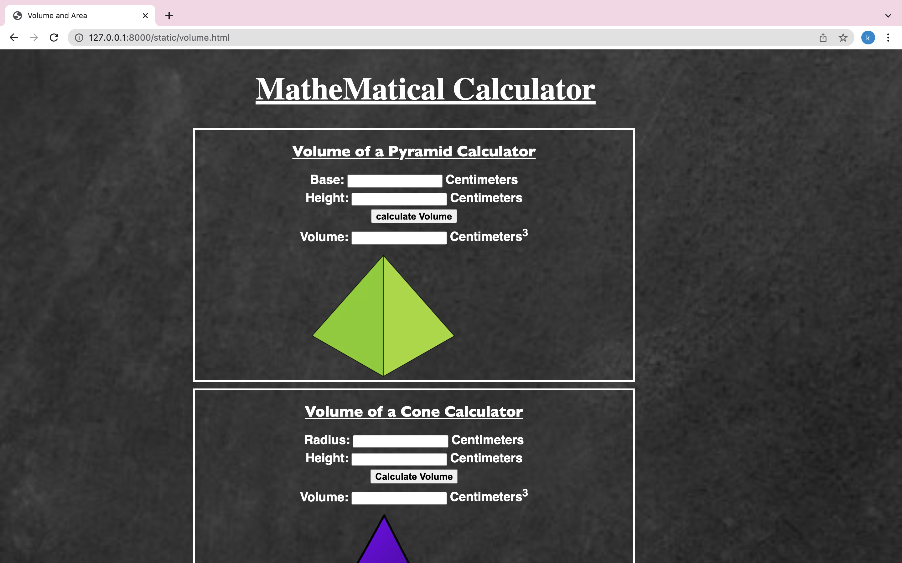

# Web Page for Mathematical Calculations

## AIM:

To design a static website with validation to perform mathematical calculations in client side.

## DESIGN STEPS:

### Step 1:

Requirement collection.

### Step 2:

Creating the layout using HTML and CSS.

### Step 3:

Write javascript to perform the calculations.

### Step 4:

Include regularexpression based input validation.

### Step 5:

Validate the layout in various browsers.

### Step 6:

Validate the HTML code.

### Step 6:

Publish the website in the given URL.

## PROGRAM :
~~~

<!DOCTYPE html>
<html lang="en">
<head>
    <meta charset="UTF-8">
    <meta http-equiv="X-UA-Compatible" content="IE=edge">
    <meta name="viewport" content="width=device-width, initial-scale=1.0">
    <title>Volume and Area</title>
    
</head>
<body>
    <h1>MatheMatical Calculator</h1>
        

            

                <h2><u>Volume of a Pyramid Calculator</u></h2>

                <form>
                    

                    <label class="labeltext">Base:</label>
                    <input type="number" id="base1">
                    <label class="labeltext">Centimeters</label> 
                    

                    

                    <label class="labeltext">Height:</label>
                    <input type="number" id="height1">
                    <label class="labeltext">Centimeters</label> 
                    

                    

                    <input class ="button "type="button" id="button1" value="calculate Volume"> 
                    

                    

                    <label class="labeltext">Volume:</label>
                    <input type="number" id="Pvolume" readonly>
                    <label class="labeltext">Centimeters3</label>
                    

                </form>
                
            

        
        

        

            

                <h2><u>Volume of a Cone Calculator</u></h2>
                <form>
                    

                    <label class="labeltext">Radius:</label>
                    <input type="number" id="Cradius">
                    <label class="labeltext">Centimeters</label> 
                    

                    

                    <label class="labeltext">Height:</label>
                    <input type="number" id="cheight">
                    <label class="labeltext">Centimeters</label> 
                    

                    

                    <input class="button" type="button" id="button2" value="Calculate Volume"> 
                    

                    

                    <label class="labeltext">Volume:</label>
                    <input type="number" id="Cvolume" readonly>
                    <label class="labeltext">Centimeters3</label>
                    

                </form>
                
            
            

        

        

            

            <form>
                <h2><u>Volume of Prism Calculator</u></h2>
                

                    <label class="labeltext">Base Area:</label>
                    <input type="number" id="basearea">
                    <label class="labeltext">Centimeters3</label> 
                

                

                    <label class="labeltext">Height:</label>
                    <input type="number" id="Prheight">
                    <label class="labeltext">Centimeters3</label> 
                

                

                    <label class="labeltext">Length:</label>
                    <input type="number" id="length">
                    <label class="labeltext">Centimeters3</label> 
                

                

                    <input class="button" type="button" id="Pbutton" value="Calculat Volume"> 
                

                

                    <label class="labeltext">Volume:</label>
                    <input type="number" id="Prvolume" readonly>
                    <label class="labeltext">Centimeters3</label>
                

            </form>
            
        

        

        
           <h3> Developed by Koduru Sanath Kumar Reddy</h3>
       
        

        
    

    
</body>
</html>
~~~
## OUTPUT:

## Result:

Thus a website is designed to perform mathematical calculations in the client side.
